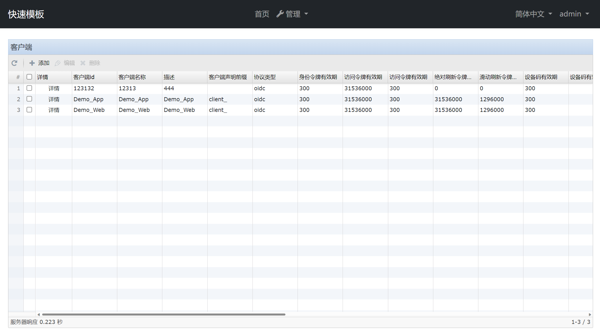

# Generic Abp
[中文](README_zh-cn.md) &nbsp;&nbsp;&nbsp; [English](README.md)

Generic Abp is a set of modules for the [ABP Framework](https://github.com/abpframework/abp#readme).

## Getting Started

1. Go to the 'build' folder in `Power Shell` and execute `build-all-release.ps1` to generate a release version of the module.
2. Go to the `nupkg` folder and execute `pack.ps1` to package the module.
3. In the `nupkg` folder, execute `push_packages.ps1` to publish the package to the NuGet server you set up

## Demo

The demo is located in the `src\demo\Generic.Abp.Demo` folder. After you open the solution, follow these steps to modify the program configuration:

1. Modify the `appsettings.json` database connection string for the `Generic.Abp.Demo.DbMigrator` project, currently using MySQL.
2. Run the `Generic.Abp.Demo.DbMigrator` project once to migrate the database.
3. Modify the `appsettings.json` database connection string for the 'Generic.Abp.Demo.Web' project, and then run the project to open the demo.
4. Log in using `admin/1q2w3E*`.

## Module description

### Generic.Abp.Application

As long as the module has changed the `Configuration` related interface and the `Settings` interface to accommodate [Sencha](https://www.sencha.com) Ext JS development, you can view it through the `swagger` of the demo program.

The module has only one project, referenced in the `HttpApi` of the Abp application and added dependencies.

### Generic.Abp.BusinessException

To encapsulate some common business contingencies, reference and add dependencies in `Domain.Shared`.

### Generic.Abp.DDD

Some extensions have been made to Abp's original domain classes and interfaces, such as adding interfaces and entity classes such as `ITree`, `ITranslation` and `Translation`.

### Generic.Abp.Enumeration

Add an enumeration class for the application and return the enumeration class to the client via the `/api/configuration/enums` interface.

To define an enumeration class, you need to reference the `Generic.Abp.Enumeration.Domain.Shared` project in the `Domain.Shared` project, and then create your own enumeration class by inheriting `Enumeration`:
```C#
    class MyEnum:  Generic.Abp.Enumeration.Enumeration<MyEnum>
    {
        public static readonly MyEnum MyEnum1 = new MyEnum(1, "MyEnum1", isDefault: true);
        public static readonly MyEnum MyEnum2 = new MyEnum(2, "MyEnum2");

        protected MyEnum(byte value, string name, string[] permission = null, bool isDefault = false,
            bool isPrivate = false) : base(value, name, permission, isDefault, isPrivate)
        {
        }
    }

```

In the enumeration class, the following 5 properties are included:

- value: Enumeration value
- name：Enumeration name
- permission: Permissions, if not private, choose which enumeration items can be returned to the client based on the permissions
- isDefault: Whether the default value
- isPrivate：Private and not returned to the client

After completing the enumeration definition, if you want the enumeration to return to the client through the interface, you need to add the enumeration to the enumeration resource in the module initialization service `ConfigureServices`:
```C#
        public override void ConfigureServices(ServiceConfigurationContext context)
        {

            Configure<EnumerationOptions>(options =>
            {
                options
                    .Resources
                    .Add(typeof(MyEnum));

            });

        }
```

### Generic.Abp.ExtResource.Application

Encapsulates the localization resources of [Sencha](https://www.sencha.com) Ext JS for dynamic localization.

Provides an interface for the [Sencha](https://www.sencha.com) Ext JS menu. In the future, the menu will be separated as a module, and the menu will be managed through the database.

### Generic.Abp.FileManagement

Encapsulates file upload functionality (`FileManager`):：

- CheckAsync: Verify by hashing the file that the file already exists, or that there is an uploaded chunk
- UploadChunkAsync: Upload a chunk of files
- MergeAsync: Merge file blocks and save
- GetFileAsync: Gets the entire file or a chunk of files
- GetThumbnailAsync: Get a preview picture of the file

### Generic.Abp.Helper

Some accessibility features such as string growth, file type detection, etc.

### Generic.Abp.IdentityServer

Added `Identity Server 4` management capabilities to [ABP Framework] (https://github.com/abpframework/abp#readme).




### Generic.Abp.W2Ui

Add [W2Ui](https://github.com/vitmalina/w2ui/) to [ABP Framework](https://github.com/abpframework/abp#readme).

### Generic.Abp.OpenIddict

Added `OpenIddict` management capabilities to [ABP Framework] (https://github.com/abpframework/abp#readme).


### Generic.Abp.Identity

- Added multilingual support for roles
- Added configuration interfaces for lockout policy and password policy for users
- Added some user management interfaces

### Generic.Abp.PhoneLogin

Add phone verification to your app.

#### OpenIddict

- Reference `Generic.Abp.PhoneLogin.Domain.Shared` in the application's `Domain.Shared` module
- Reference `Generic.Abp.PhoneLogin.Domain` in the application's `Domain` module
- Reference `Generic.Abp.PhoneLogin.Account.Web` and `Generic.Abp.PhoneLogin.OpenIddict.AspNetCore` in the application's `Web` module

#### IdenttityServer

- Reference `Generic.Abp.PhoneLogin.Domain.Shared` in the application's `Domain.Shared` module
- Reference `Generic.Abp.PhoneLogin.Domain` amd `Generic.Abp.PhoneLogin.IdentityServer.Domain` in the application's `Domain` module
- Reference `Generic.Abp.PhoneLogin.Account.Web` in the application's `Web` module

For a specific example, please see the branch `测试identtiyServer4手机登录`


Note: Authenticating to acquire a token using `REST Client` requires adding a `RedirectUris` (`https://localhost:44350/signin-oidc`) and a `CorsOrigins` (`https://localhost`) for 'Demo_App'.

## References

- [Sencha](https://www.sencha.com)
- [ABP Framework](https://github.com/abpframework/abp#readme)
- [W2Ui](https://github.com/vitmalina/w2ui/) 
- [SmartEnum](https://github.com/ardalis/SmartEnum)
- [Mime Detective](https://github.com/Muraad/Mime-Detective)

## Thanks

<a href="https://www.jetbrains.com/?from=GenericAbp">
    
</a>
