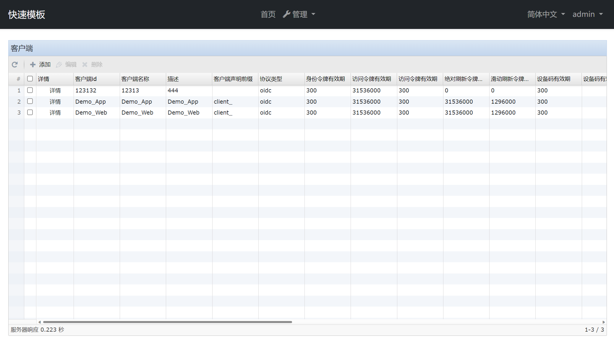
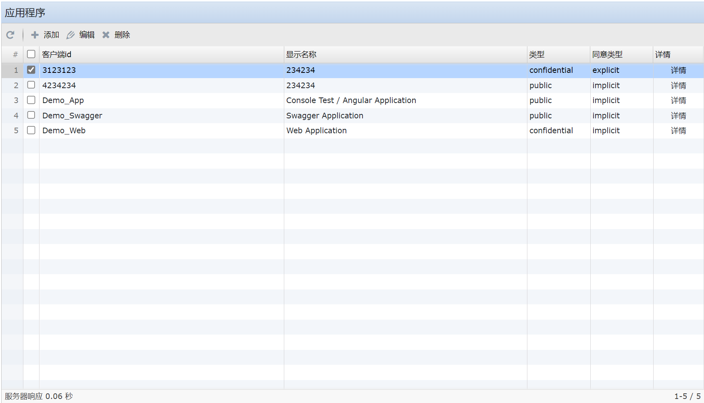
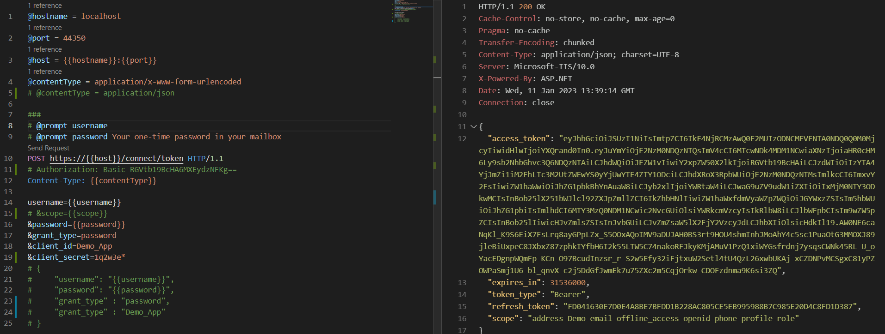

# Generic Abp
[中文](README_zh-cn.md) &nbsp;&nbsp;&nbsp; [English](README.md)

Generic Abp是一套适用于[ABP Framework](https://github.com/abpframework/abp#readme)的模块。

## 开始

1. 在`power shell`进入`build`文件夹，执行`build-all-release.ps1`为模块生成发布版本
2. 进入`nupkg`文件夹，执行`pack.ps1`对模块进行打包
3. 在`nupkg`文件夹，执行`push_packages.ps1`将包发布自己架设的NuGet服务器

## 演示程序

演示程序位于`src\demo\Generic.Abp.Demo`文件夹。打开解决方案后，按以下步骤进行修改程序配置：
1. 修改`Generic.Abp.Demo.DbMigrator`项目的`appsettings.json`数据库连接字符串，目前方案使用的是MySql。
2. 执行一次`Generic.Abp.Demo.DbMigrator`项目来迁移数据库
3. 修改`Generic.Abp.Demo.Web`项目的`appsettings.json`数据库链接，然后运行该项目即刻打开演示程序。
4. 使用admin/1q2w3*登录

## 模块说明

### Generic.Abp.Tailwind

使用Tailwind CSS重写了ABP的默认主题，并重写了Account模块的登录及其相关页面。本模块只支持OpenIddict，不支持IdentityServer。
本模块还重写了Volo.Abp.OpenIddict.AspNetCore模块，因为该模块的授权页面使用了ABP的默认主题，导致样式不统一。
该模块仅供学习和参考，不建议在生产环境中使用。

### Generic.Abp.Application

该模块只要是为了适应[Sencha](https://www.sencha.com) Ext JS开发而更改了`Configuration`相关接口以及`Settings`接口，可通过演示程序的`swagger`查看。

该模块只有一个项目，在Abp应用程序的`HttpApi`引用并添加依赖。

### Generic.Abp.BusinessException

用于封装一些常见的商业意外，在`Domain.Shared`引用并添加依赖。

### Generic.Abp.DDD

对Abp原有的领域类和接口做了一些扩充，如增加`ITree`、`ITranslation`和`Translation`等接口和实体类。

### Generic.Abp.Enumeration

为应用程序添加枚举类并通过`/api/configuration/enums`接口将枚举类返回客户端。

要定义枚举类，需要在`Domain.Shared`项目中引用`Generic.Abp.Enumeration.Domain.Shared`项目，然后通过继承`Enumeration`来创建自己的枚举类：
```C#
    class MyEnum:  Generic.Abp.Enumeration.Enumeration<MyEnum>
    {
        public static readonly MyEnum MyEnum1 = new MyEnum(1, "MyEnum1", isDefault: true);
        public static readonly MyEnum MyEnum2 = new MyEnum(2, "MyEnum2");

        protected MyEnum(byte value, string name, string[] permission = null, bool isDefault = false,
            bool isPrivate = false) : base(value, name, permission, isDefault, isPrivate)
        {
        }
    }

```

在枚举类中，包含以下5个属性：

- value: 枚举值
- name：枚举名
- permission: 权限，如果不是私有，会根据权限选择哪些枚举项可返回客户端
- isDefault: 是否默认值
- isPrivate：私有，不会返回客户端

完成枚举定义后，如果希望枚举通过接口返回客户端，需要在模块初始化服务`ConfigureServices`中将枚举添加到枚举资源中：
```C#
        public override void ConfigureServices(ServiceConfigurationContext context)
        {

            Configure<EnumerationOptions>(options =>
            {
                options
                    .Resources
                    .Add(typeof(MyEnum));

            });

        }
```


### Generic.Abp.ExtResource.Application

封装了[Sencha](https://www.sencha.com) Ext JS的本地化资源以实现动态本地化。

为[Sencha](https://www.sencha.com) Ext JS菜单提供了接口。未来会将菜单独立为一个模块，通过数据库来管理菜单。

### Generic.Abp.FileManagement

封装了文件上传的相关功能(`FileManager`)：

- CheckAsync: 通过文件的散列值验证文件是否已存在，或是否存在已上传部分
- UploadChunkAsync: 上传文件块
- MergeAsync: 合并文件块并保存
- GetFileAsync: 获取整个文件或某一块文件
- GetThumbnailAsync: 获取文件预览图片

### Generic.Abp.Helper

一些诸如字符串增长、文件类型检测等辅助功能。

### Generic.Abp.IdentityServer

为[ABP Framework](https://github.com/abpframework/abp#readme)添加`Identity Server 4`管理功能.




### Generic.Abp.W2Ui

为[ABP Framework](https://github.com/abpframework/abp#readme)添加[W2Ui](https://github.com/vitmalina/w2ui/).

### Generic.Abp.OpenIddict

为[ABP Framework](https://github.com/abpframework/abp#readme)添加`OpenIddict`管理功能.



### Generic.Abp.Identity

- 为角色添加了多语言支持
- 为用户添加了锁定策略和密码策略的配置接口
- 增加了一些用户管理接口

### Generic.Abp.PhoneLogin

为应用添加手机验证。

#### OpenIddict

- 在应用的`Domain.Shared`模块引用`Generic.Abp.PhoneLogin.Domain.Shared`
- 在应用的`Domain`模块引用`Generic.Abp.PhoneLogin.Domain`
- 在应用的`Web`模块引用`Generic.Abp.PhoneLogin.Account.Web`和`Generic.Abp.PhoneLogin.OpenIddict.AspNetCore`

#### IdenttityServer

- 在应用的`Domain.Shared`模块引用`Generic.Abp.PhoneLogin.Domain.Shared`
- 在应用的`Domain`模块引用`Generic.Abp.PhoneLogin.Domain`和`Generic.Abp.PhoneLogin.IdentityServer.Domain`
- 在应用的`Web`模块引用`Generic.Abp.PhoneLogin.Account.Web`

具体示例可查看分支`测试identtiyServer4手机登录`



注意：使用`REST Client`验证获取令牌需要为`Demo_App`添加跳转地址(`edirectUris`，`https://localhost:44350/signin-oidc`)和跨域地址(`CorsOrigins`, `https://localhost`)。

#### 输入验证

- 在应用的`Application`模块引用`Generic.Abp.PhoneLogin.Application`
- 在应用的`Domain`模块引用`Generic.Abp.PhoneLogin.Domain`
- 在应用的`Web`模块引用`Generic.Abp.PhoneLogin.Web`

### Metro UI 主题

- 在应用的`Web`模块引用`Generic.Abp.Metro.UI.Account.Web.OpenIddict`
- 在应用的`Web`模块引用`Generic.Abp.Metro.UI.Identity.Web`
- 在应用的`Web`模块引用`Generic.Abp.Metro.UI.OpenIddict.Web`

如果想查看Metro UI的演示程序，可在`Web`模块引用`Generic.Abp.Metro.UI.Theme.Basic.Demo`。

## 引用

- [Sencha](https://www.sencha.com)
- [ABP Framework](https://github.com/abpframework/abp#readme)
- [W2Ui](https://github.com/vitmalina/w2ui/) 
- [SmartEnum](https://github.com/ardalis/SmartEnum)
- [Mime Detective](https://github.com/Muraad/Mime-Detective)
- [Metro UI](https://metroui.org.ua/intro.html)
- [Lodash](https://lodash.com/docs/4.17.15)

## 感谢

<a href="https://www.jetbrains.com/?from=GenericAbp">
    
</a>
